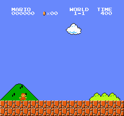
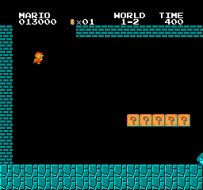

# mario_dqn_cpp — DQN from scratch in C++ (→ Super Mario on a real NES)

*[日本語](README.md) | English*

Build **DQN (Deep Q-Network) from scratch on a self-made autograd engine (C++ standard
library, CPU only)**, and ultimately make it **play Super Mario Bros on a real NES
emulator**. DQN is the **value-based, off-policy** counterpart to the AlphaZero
(policy + search) of [othello_alphazero_cpp](https://github.com/yomei-o/othello_alphazero_cpp).

The autograd is reused from [mini-yolov5-cpp](https://github.com/yomei-o/mini-yolov5-cpp).

## 🎮 Latest play: DQN clears Super Mario Bros 1-1 from the start on its own



The self-made autograd + DQN (CPU only), looking at **RAM features alone**, plays **1-1 all the
way from the start to the flagpole** (a recording of deterministic, reproducible real play, at
roughly 2× speed). Score-first reward shaping makes it **stomp enemies and rack up coins/points**
on its way to the goal. See [`RESUME.md`](RESUME.md) for how training and recording work. The GIF
is generated from `web/run.bin` (the recording) with `ffmpeg` ([`tools/make_gif.sh`](tools/make_gif.sh)).

## 🕹️ Play in the browser (WASM)

The **whole NES (LaiNES) + DQN inference stack is compiled to WebAssembly**, so you can run
both "replay of a clear run" and "live inference of the trained net" in the browser. You load
the ROM yourself via file picker (**it is never uploaded**).

- **[▶ 1-1 demo: yomei-o.github.io/mario_dqn_cpp/mario-dqn](https://yomei-o.github.io/mario_dqn_cpp/mario-dqn/)** — full clear from start to the flagpole + live inference.
- **[▶ 1-2 demo: yomei-o.github.io/mario_dqn_cpp/mario-dqn-1-2](https://yomei-o.github.io/mario_dqn_cpp/mario-dqn-1-2/)** — after the 1-1 clear → 1-2 transition, the trained agent (with a NOOP = wait action) waits out the mid-level "pit + turtle" to break through (x≈978; the goal is still being learned).
- **[▶ 1-3 demo](https://yomei-o.github.io/mario_dqn_cpp/mario-dqn-1-3/)** — starts directly via a **RAM level warp** (no 1-2 clear needed). The trained agent reaches the mid-air platform zone at x≈627.
- **[▶ 1-4 demo](https://yomei-o.github.io/mario_dqn_cpp/mario-dqn-1-4/)** — warps into the castle stage (axe clear). The trained agent reaches the early section at x≈302.

> The main purpose of 1-2–1-4 is to provide the **per-level framework (env, reward, warp start,
> training, WASM) as a reusable template**. A "full clear" of each stage is left open as headroom
> (they piggyback on `train_common.hpp` / `mario_shared.h`; swap in at the same URL via
> `NET=... build_wasmXX.sh`).

## 🚇 Taking on World 1-2 (Phase 5)



1-2 is an underground stage where clearing requires **entering a pipe**, so it is a different
beast from 1-1. The first goal is play that gets **partway through** (the GIF above is a recording
of an exploration policy reaching x≈1202 in the early-to-mid part of 1-2). Stage-specific elements
(start position, clear condition, **a reward with a separate bonus for entering the pipe**) are
split off from 1-1, while the **common core** for observation/action/emulator-driving is shared
(`mario_shared.h` / `mario12.*` / `train12.cpp`).

1-2 has a timing gotcha where you must "**wait for a turtle walking on the far side of a pit**
before jumping" — a right-biased policy can't get past it. So a **NOOP (wait)** action is added to
1-2's action set, and the reward is redesigned to be **ratchet-based for progress with no penalty
for waiting**, after which the trained agent actually learns to *wait, then jump* (warm-started
from the 1-1 net, up to x≈978). Reaching the exit pipe / flag (= a full clear) is not there yet;
the plan is to capture one clear by exploration → BC as the next step ([`RESUME.md`](RESUME.md)).

## Roadmap

| Phase | What | Status |
|------|------|--------|
| **1** | **Prove the DQN core on CartPole** (replay, target net, Double DQN, ε-greedy, grad clipping, Adam) | ✅ done |
| **2** | Embed **LaiNES** (C++ NES emulator); headless `step/obs/reward/done` API | ✅ done |
| **3** | DQN × Super Mario (**RAM features**: Mario x/y, velocity, enemies); learn to go far | 🚧 in progress |
| **4** | Compile NES + DQN to **WASM (Emscripten)**; play in the browser (HTML + JS canvas) | ✅ done ([live demo](https://yomei-o.github.io/mario_dqn_cpp/mario-dqn/)) |

> **Resuming later?** Current status and next steps are in [`RESUME.md`](RESUME.md).

## Phase 2 (headless NES) — done

`third_party/laines/` vendors the **LaiNES** (BSD-2) core, **stripped of SDL/audio/GUI**
(`GUI::new_frame` = grab framebuffer, `GUI::get_joypad_state` = inject input, APU stubbed).
`nes.h/.cpp` exposes a WASM-friendly frame-driven API (`load_file`/`load_bytes`, `set_buttons`,
`step_frame`, `pixels`, `ram`). It **builds with plain MSVC/Visual Studio** — LaiNES's GNU
case-ranges were rewritten to if/else, so no MinGW is needed (avoids antivirus false positives);
clang/g++/emcc compile the same code. Verified: real SMB boots and Mario walks right (RAM
x-position increases) under `nes_test`.

> **Design call**: "raw pixels → clear a real Mario level on CPU + a from-scratch autograd"
> is not realistic (Atari DQN took days on GPUs back then). So the environment is a **real
> NES emulator** while the state is **RAM features** (read from the real RAM) — that makes
> "real Mario improving in a reasonable time" achievable.

## Phase 1 (current state)

A minimal DQN that solves CartPole-v1 — the scaffold for plugging the *same agent* into Mario.

```
autograd.h/.cpp   self-made autograd (reused from mini-yolov5) + Huber loss
cartpole.h        CartPole-v1 environment (Gym-accurate physics)
qnet.h            Q-net MLP + Adam + target-network copy
replay.h          experience replay buffer (ring)
main.cpp          training loop (Double DQN, ε decay, grad clip, best-net checkpoint, eval)
```

### Build & run

```powershell
cmake -S . -B build -G "Visual Studio 17 2022" -A x64
cmake --build build --config Release
build/Release/dqn.exe        # trains CartPole, prints greedy-policy evaluation
```

Linux/mac: `cmake -S . -B build && cmake --build build`. Compiler only.

Result: solves CartPole (greedy eval reaches the 500-step cap).

### DQN essentials

- **Experience replay**: store `(s, a, r, s', done)`, train on random minibatches (breaks correlation)
- **Target network**: a frozen copy for the TD target to prevent divergence (reuses AlphaZero's `copy_from`)
- **Double DQN**: online net picks the next action, target net scores it (less overestimation)
- **TD loss**: move only the taken action's Q toward `r + γ·maxQ'` (Huber loss)
- **ε-greedy**: exploration decays 1.0 → 0.05
- **Stability**: global-norm gradient clipping + Adam + best-net checkpointing

## About Super Mario (Phase 2+)

- Embeds a **real NES emulator (LaiNES)** (same lineage as the core of `gym-super-mario-bros`)
- **ROMs are copyrighted** — supply your own; no ROM is included in the code
- Reward: `Δ(Mario x-position) − time penalty − death penalty + goal bonus`

## Series

Building AI from scratch in C++/CPU. Related:
[mini-yolov5-cpp](https://github.com/yomei-o/mini-yolov5-cpp) /
[othello_alphazero_cpp](https://github.com/yomei-o/othello_alphazero_cpp) /
[nanoGPT-cpp](https://github.com/yomei-o/nanoGPT-cpp) /
[nanochat-cpp](https://github.com/yomei-o/nanochat-cpp) /
[lecun1989-cpp](https://github.com/yomei-o/lecun1989-cpp)
